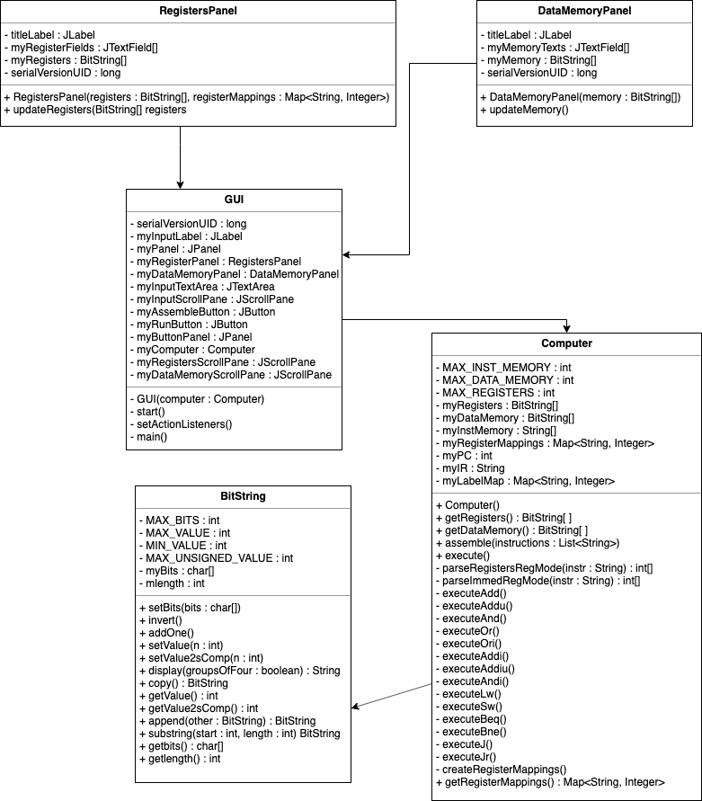

# Mega Impressive Programming Project

This project is a MIPS simulator created in Java with a GUI created in Java Swing. The GUI allows users to enter their MIPS code in a text area as well as allowing registers and memory to be viewed and modified. 


  - [Project Decisions and Considerations](#project-decisions-and-considerations)
  - [How to Run the Program](#how-to-run-the-program)
    - [How to Enter Values into Register/Memory](#how-to-enter-values-into-registermemory)
    - [How to Format Instructions](#how-to-format-instructions)
  - [Not Handled by Our Simulator](#not-handled-by-our-simulator)
    - [](#)
    - [Incorrect Code](#incorrect-code)
  - [Tests](#tests)
  - [UML Diagram](#uml-diagram)
  - [Built With](#built-with)
  - [Authors](#authors)

## Project Decisions and Considerations 

* Our program works with assembly level langauge 
* Spaces and commas are ignored
* Input is taken through the GUI and stored in instruction memory 
  * Instruction memory is 50 
* Memory exists in the form of data memory/instruction memory 
  * Data memory is visualized by the GUI
* 32 registers that are visualized by the GUI 
* Instructions are executed all at once 


## How to Run the Program 
Once you have downloaded the component files and started up the GUI, 
1. Enter MIPS code into the main text box. Formatting is flexible and is described in more detail [below.](###How-to-format-instructions)
2. Enter values into register/memory text boxes as desired. Further instruction on how to do this [follows.](###How-to-Enter-Values-into-Register/Memory)
3. Click the ``Assemble`` button. 
4. Click the ``Run`` button. 

### How to Enter Values into Register/Memory 

1. Click the appropriate register/memory 
2. Select and delete all of the present text 
3. Enter the desired **decimal** value and press Enter to convert to binary 

### How to Format Instructions 
Multiple instruction formats are valid and will run within the Mega Impressive Programming Simulator; however, the preferred method of input format is the same format as MARS. 

* Case is ignored 
* Registers can be entered with or without dollar signs 
* Registers can be entered by their number or by register
* Both commas and spaces are handled 
* ``.data`` and ``.text`` are **not** handled 

## Not Handled by Our Simulator
### Incorrect Code 
* The Mega Impressive Programming Simulator is not equipped to deal with bad code -- behavior under these conditions is unpredictable. Hopefully your code works! 

An example of some code that won't work: 
```
ADDI $t1, $t2, $t3
```
```
LW $t1, $t2, $t3 
```

## Tests

JUnit tests were created for the Computer class and can be found under ``ComputerTest.java``. 

## UML Diagram 

## Built With

* Java
* Java Swing

## Authors

* [Thaddaeus Hug](https://github.com/tadhug)
* [Mercedes Chea](https://github.com/mercedeschea)
* [Mariko Briggs](https://github.com/marikobriggs)
